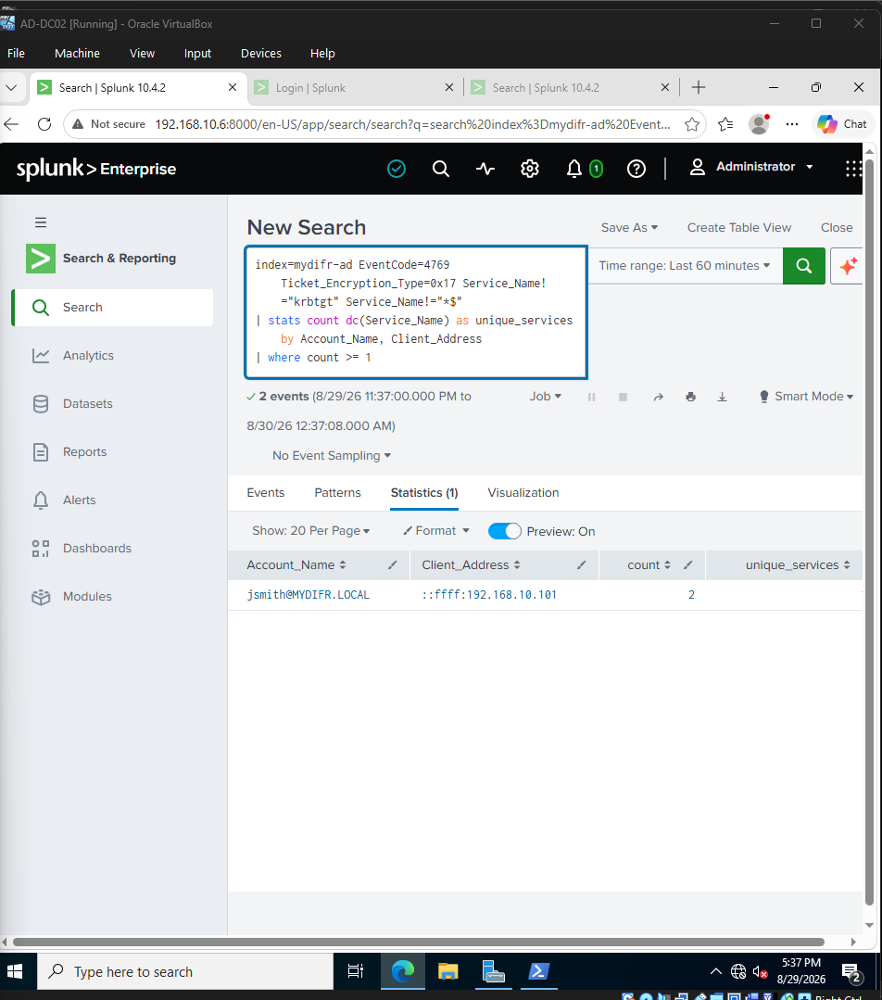
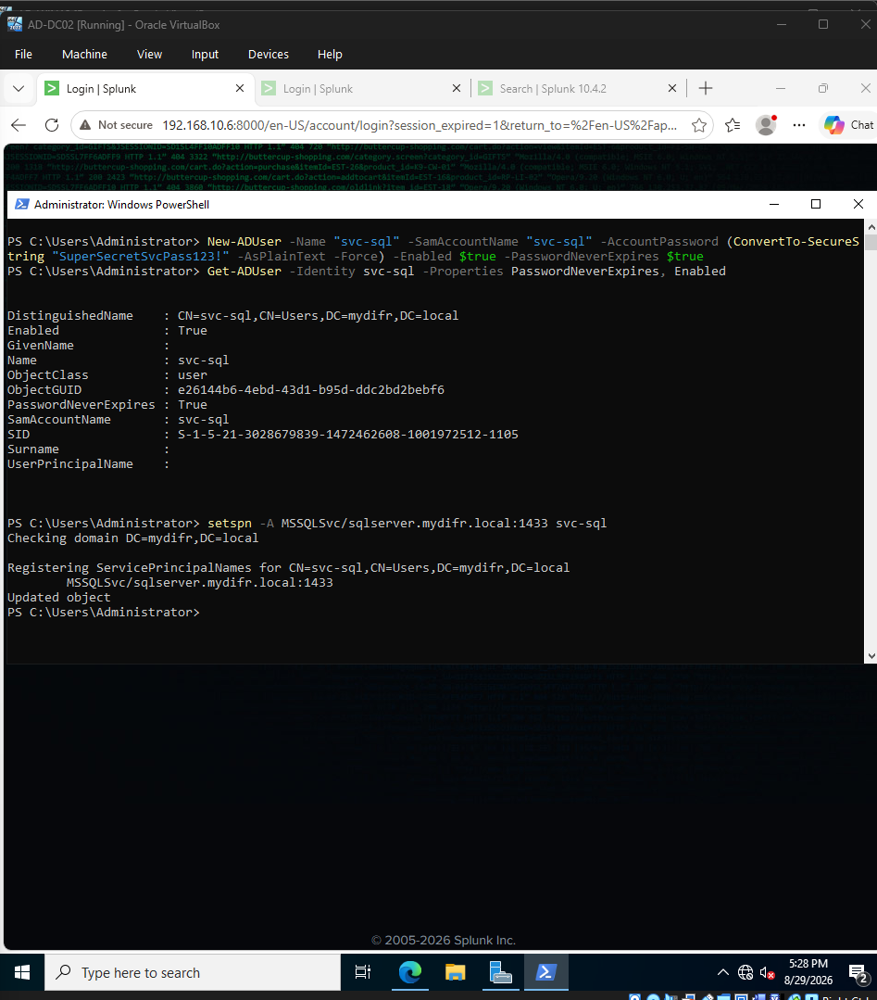
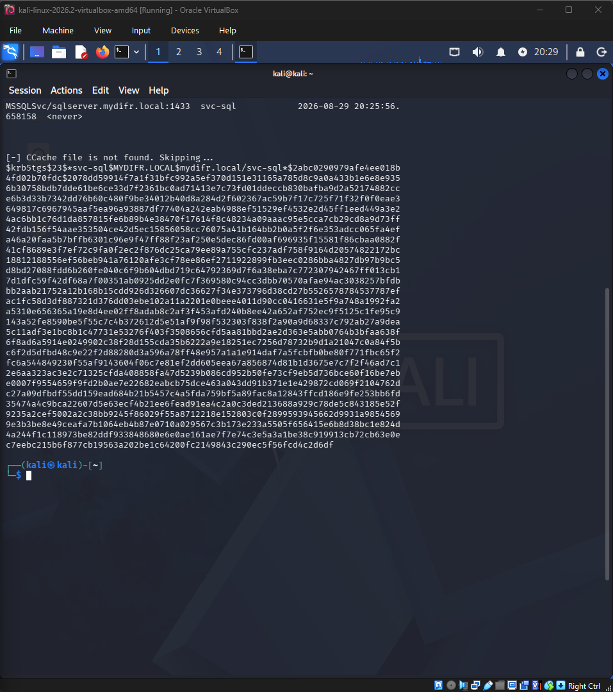
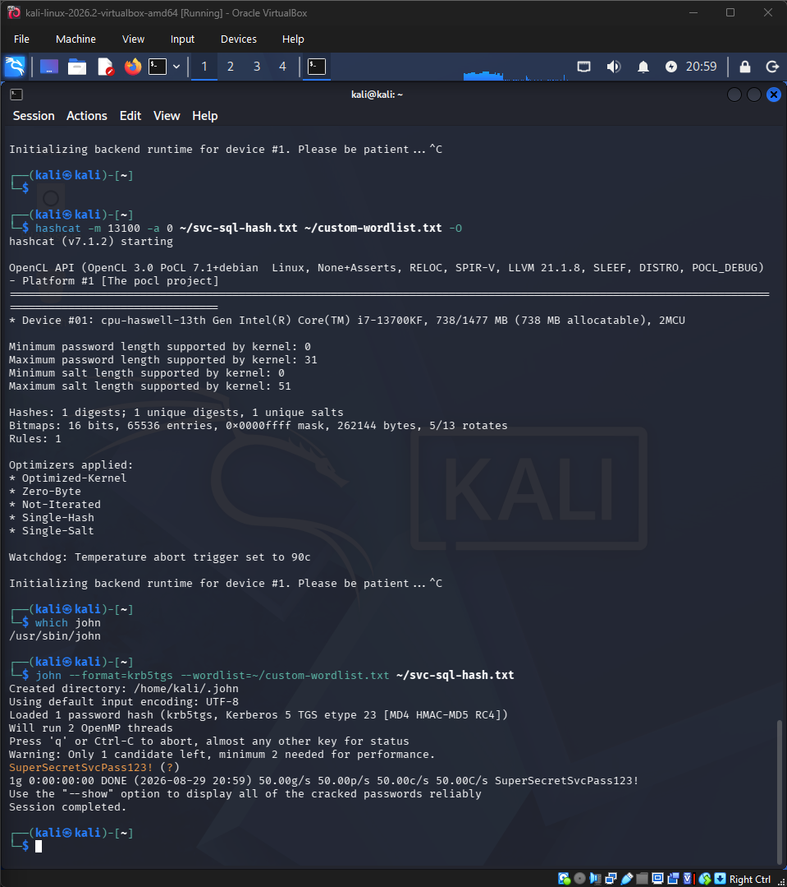
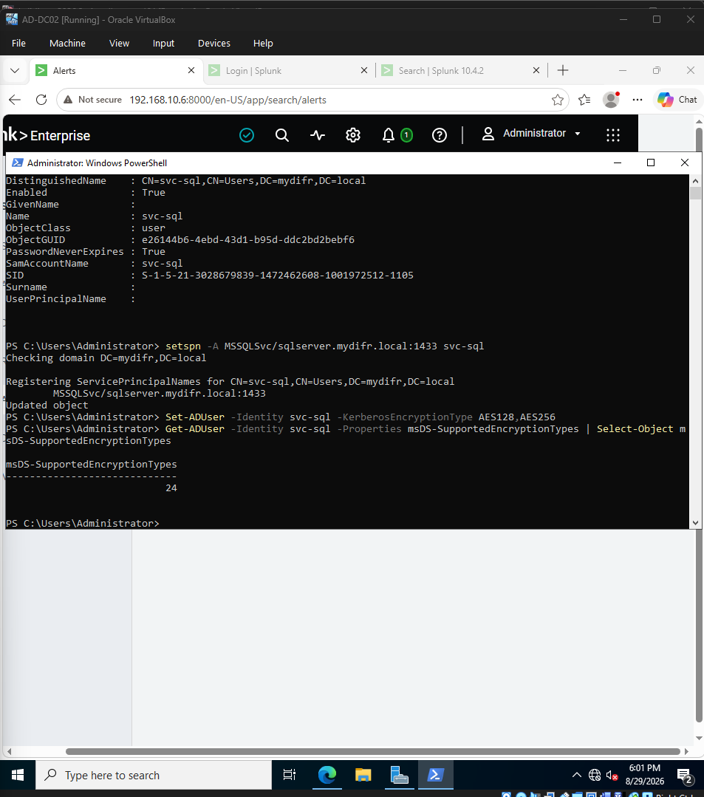
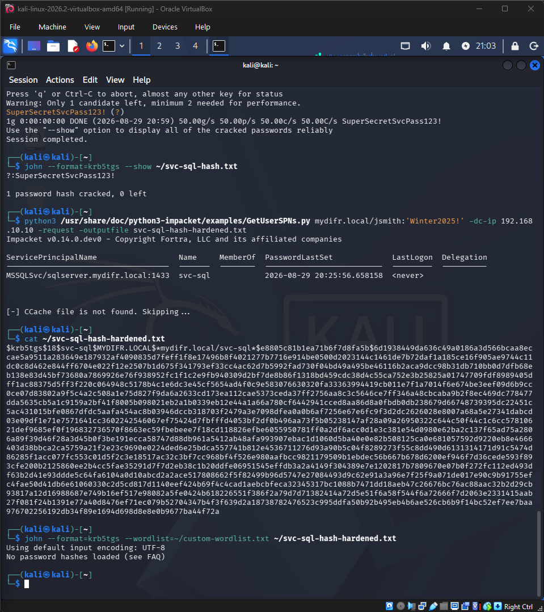

# Full Project Writeup — AD Home Lab with Splunk SIEM and SOAR Automation

> **Note on this document:** Sections marked **[PLANNED — NOT YET VERIFIED]** describe intended behavior that has been designed and built but not yet executed against the real environment. Sections marked **[VERIFIED]** have been run against the real environment and reflect actual observed results, including real debugging.

---

## 1. Executive Summary

This project simulates a small enterprise Active Directory environment, then layers detection engineering and automated incident response on top of it. The scenario: a domain account is compromised via brute force, the compromise is detected by a custom SIEM pipeline, and a tiered response — partly automated, partly human-approved — contains it. A second attack stage (Kerberoasting) is chained onto the first to demonstrate a realistic multi-step compromise rather than an isolated technique.

Base reference: MYDFIR's "Active Directory Project 2.0" tutorial series, extended with several original additions (Section 9), and with several real infrastructure limitations discovered and worked around during build (Section 10).

---

## 2. Environment

Built entirely on local VirtualBox (not cloud-hosted), on a NAT Network named `AD-Project` (`192.168.10.0/24`).

| VM | Role | IP | Specs |
|---|---|---|---|
| AD-DC02 | Domain Controller (`mydifr.local`) | 192.168.10.10 | Windows Server 2022, 4096MB RAM, 2 CPU |
| AD-WIN10 | Domain-joined workstation | 192.168.10.100 | Windows 10 Pro, 6144MB RAM, 2 CPU |
| Splunk-SVR | SIEM | 192.168.10.6 | Ubuntu Server 24.04 LTS, 6144MB RAM, 2 CPU |
| Kali Linux | Attacker | **192.168.10.101 (static)** | Kali rolling, default image |

Each Windows VM and Splunk-SVR has a second NIC on plain NAT for host internet access and port-forwarding, kept separate from the internal lab network — meaning the host machine cannot directly reach `192.168.10.0/24` addresses without explicit port forwarding.

Domain user of interest: `mydifr\jsmith` (password: `Winter2025!`). AD-WIN10 also has a local admin account, `localadmin`, used for machine-level configuration (e.g. enabling Remote Desktop) that jsmith doesn't have rights to perform.

**[VERIFIED]** Kali initially relied on DHCP and was assigned `192.168.10.6` — an IP collision with Splunk-SVR's static address. Resolved by manually configuring Kali with a static IP (`192.168.10.101`) outside the DHCP-assigned range.

---

## 3. Build Process

1. All four VMs built and networked; connectivity verified via ping across the NAT Network.
2. AD DS installed on AD-DC02; promoted to domain controller for `mydifr.local`.
3. AD-WIN10 domain-joined; `jsmith` login confirmed.
4. Splunk Enterprise installed on Splunk-SVR; index `mydifr-ad` created; receiving port 9997 configured.
5. Splunk Universal Forwarder installed on both Windows VMs, configured to forward Security/System/Application Windows Event Logs plus Sysmon telemetry to Splunk-SVR.
6. Sysmon (SwiftOnSecurity configuration) installed on both Windows machines for enhanced telemetry beyond native Windows logging.
7. Ingestion confirmed for both hosts in Splunk Web.

**Notable build issue:** a typo (`mydifr.local` instead of the intended `mydfir.local`) occurred during AD DS promotion and was deliberately kept rather than corrected via demote/re-promote, since that path had already produced errors. All subsequent configuration (index name, base DN, etc.) is intentionally consistent with the typo'd spelling.

**[VERIFIED] VM clock drift after saved-state pauses.** Both AD-DC02 and Splunk-SVR developed significant system clock drift (Splunk-SVR was off by ~4 hours) after sitting in VirtualBox's saved-state for an extended period between sessions. This silently broke Splunk's alert scheduling. Fixed via `sudo timedatectl set-ntp true` on Splunk-SVR followed by `sudo /opt/splunk/bin/splunk restart --run-as-root`. **Lesson for future sessions:** always verify VM clocks after resuming from a long saved-state before trusting any timestamp-dependent behavior (alert scheduling, event correlation, screenshots).

---

## 4. Detection Engineering

Three alerts, each targeting a distinct stage of the attack chain (Section 6), tuned to reduce false positives specific to this lab's fully-internal topology.

### 4.1 — Unauthorized Successful Logon (Event ID 4624) — [VERIFIED]

```spl
index=mydifr-ad EventCode=4624
(Source_Network_Address=* AND Source_Network_Address!="-"
 AND NOT (Source_Network_Address="192.168.10.10" OR Source_Network_Address="192.168.10.100"))
| stats count by _time, ComputerName, Source_Network_Address, user, Logon_Type
```

Unlike the base tutorial (which relied on a public/private IP split), this environment is fully internal, so "unauthorized" is defined via an allowlist of the two legitimate hosts (the DC and the workstation) rather than a geographic/network boundary.

**Field-name correction:** the field is `Source_Network_Address` (capitalized, underscored — matching Windows' raw XML field naming) — not the lowercase `source_network_address` originally assumed. This was silently causing the query to return zero results despite matching events genuinely existing in the index. Confirmed by manually expanding a real event's full field list in Splunk rather than trusting an assumed name. **This is inconsistent across event types** — see 4.2 below, where the lowercase form turned out to be correct.

### 4.2 — Brute-Force Threshold, Time-Windowed (Event ID 4625) — [VERIFIED]

```spl
index=mydifr-ad EventCode=4625 LogName=Security
| sort 0 _time
| streamstats time_window=90s count as recent_failures by user, src_ip
| where recent_failures >= 5
```

A rolling time window was chosen over a flat count specifically to distinguish tool-speed brute-forcing (many attempts in seconds) from slower, non-malicious noise such as a stale cached credential retrying periodically over hours.

**Field name:** unlike 4624, the lowercase `src_ip` field is correct here — Splunk's Windows TA generates a CIM-normalized lowercase field for 4625 events that it does not consistently generate for 4624. **Verified by expanding a real 4625 event's full field list**, rather than assuming consistency with the 4624 fix.

**Two additional real bugs found and fixed:**
- `streamstats` with `time_window` requires events in ascending chronological order. Splunk's default result order is newest-first, which silently breaks the trailing-window calculation. Fixed by adding `| sort 0 _time` before the `streamstats` line.
- With exactly 5 real failed attempts generated during testing, `where recent_failures > 5` can mathematically never trigger (it requires a 6th attempt to exceed 5). Corrected to `>= 5`.

**Window sizing note:** `time_window=90s` was tuned against real observed data — 5 manually-generated failed login attempts (see Section 5, Phase 1) spanned a full 51 seconds due to the manual pace of triggering each one individually. A production deployment tuned against genuine automated brute-force tooling (which operates on the order of seconds, not tens of seconds) would likely use a much tighter window, closer to the original `10s` design intent.

### 4.3 — Kerberoasting Detection (Event ID 4769) — [VERIFIED]

```spl
index=mydifr-ad EventCode=4769 Ticket_Encryption_Type=0x17 Service_Name!="krbtgt" Service_Name!="*$"
| stats count dc(Service_Name) as unique_services by Account_Name, Client_Address
| where count >= 1
```

Flags RC4-encrypted service ticket requests (the weaker, more easily-cracked encryption type) from an account requesting tickets for non-machine, non-krbtgt services — the behavioral signature of an SPN-enumeration tool rather than normal usage. On a modern domain, legitimate Kerberos traffic almost always negotiates AES (`0x12`); an explicit RC4 (`0x17`) request for a real service account stands out clearly against that background.

**Field-name correction — the same lesson, a third time.** The draft version of this query used `IpAddress` as the field holding the source IP. Verified against a real captured 4769 event, `IpAddress` is blank/invalid for this event type; the correct field is **`Client_Address`** (which returns values like `::ffff:192.168.10.101`). The service and account fields (`Service_Name`, `Ticket_Encryption_Type`, `Account_Name`), however, *were* correct as originally drafted — checked the same way, by expanding a real event's field list, rather than assuming. This reinforces the core lesson from 4.1/4.2: field names must be verified per event type, every time, because some assumptions hold and some silently don't.

**Threshold — demo vs. production.** The threshold here is set to `count >= 1` so the alert fires on a single roasted service, matching what was actually tested in this lab (one target service account, `svc-sql`). A realistic production deployment would set this higher (e.g. `count > 3`, the original design intent) to specifically catch a *spree* — one account roasting many distinct SPNs in a short window, which is the true attacker signature — while treating a single one-off service ticket request as likely-benign background noise (a legitimate service starting up, for instance). The trade-off is deliberately documented rather than the threshold silently lowered to force a passing result: the lower value demonstrates the detection works, and the higher value reflects how it would actually be tuned to avoid false positives in production.



---

## 5. Attack Simulation Methodology

### Phase 1 — Brute Force (T1110) — [VERIFIED, with a real tooling substitution]

**Original plan:** run Hydra from Kali against jsmith over RDP.

**What actually happened:** Hydra's RDP module (explicitly labeled "experimental" by Hydra itself) successfully identified the correct password (`jsmith:Winter2025!`) but **did not generate a corresponding Windows Security event**. Investigation (checking Event Viewer directly on AD-WIN10, bypassing Splunk entirely) confirmed zero 4624/4625 events were logged for the time window Hydra ran in, despite Hydra reporting a valid password found. This appears to be a known limitation where Hydra's RDP module validates credentials at a lower protocol layer without completing a full interactive logon session that Windows would log.

**Workaround used:** manual `xfreerdp` connections instead, which do complete a full RDP handshake and reliably generate real Windows Security events:

```
xfreerdp /v:192.168.10.100 /u:jsmith /p:'<password>' /cert:ignore
```

Five wrong passwords were attempted this way (generating 5 real 4625 events, timestamps spanning 51 seconds), followed by the correct password (generating one real 4624 event, Logon Type 10, `Source_Network_Address: 192.168.10.101`).

**Two additional real prerequisites discovered before RDP would accept any login at all:**
- Remote Desktop is disabled by default on Windows 10 and had to be manually enabled (Settings → System → Remote Desktop) — this specifically required being logged in as the local `localadmin` account, since jsmith (a standard domain user) does not have rights to change this system setting.
- Even with RDP enabled, jsmith's login was rejected with "account not active for remote desktop" until explicitly added to the local Remote Desktop Users group: `net localgroup "Remote Desktop Users" mydifr\jsmith /add`. Enabling RDP does not, by itself, authorize any given user to use it.

**Result:** Alert 4.2 (brute-force threshold) fired correctly on the 5 manual failures; Alert 4.1 (unauthorized successful logon) fired correctly on the final successful login.

### Phase 2 — Kerberoasting (T1558.003) — [VERIFIED]

**Setup — a deliberately vulnerable service account.** A dedicated service account, `svc-sql`, was created on AD-DC02 with `PasswordNeverExpires` set (mimicking how real service accounts are commonly, and insecurely, configured — which is a large part of why Kerberoasting is a realistic threat rather than a theoretical one):

```powershell
New-ADUser -Name "svc-sql" -SamAccountName "svc-sql" -AccountPassword (ConvertTo-SecureString "SuperSecretSvcPass123!" -AsPlainText -Force) -Enabled $true -PasswordNeverExpires $true
```

A fake SQL Server SPN was then registered against it — SQL service accounts being a classic real-world Kerberoasting target due to their frequently weak, static passwords. Registering the SPN is what actually makes the account roastable, since it advertises the account as offering a service, allowing any authenticated domain user to request a Kerberos service ticket for it:

```powershell
setspn -A MSSQLSvc/sqlserver.mydifr.local:1433 svc-sql
```



**The attack.** Using `jsmith`'s credentials (compromised in Phase 1), Impacket's `GetUserSPNs.py` was run from Kali to enumerate SPN-bearing accounts and request the service ticket. On Kali, the script lives at `/usr/share/doc/python3-impacket/examples/GetUserSPNs.py` (bundled with the `python3-impacket` package, not on the default PATH):

```
python3 /usr/share/doc/python3-impacket/examples/GetUserSPNs.py mydifr.local/jsmith:'Winter2025!' -dc-ip 192.168.10.10 -request -outputfile svc-sql-hash.txt
```

This returned a full `$krb5tgs$23$*svc-sql$MYDIFR.LOCAL$...` ticket hash — the `23` denoting RC4 encryption (`0x17`), the crackable artifact. It was saved to a file for the cracking step.



**Detection.** The attack generated real 4769 events on AD-DC02, which the 4.3 detection query correctly isolated from normal Kerberos background traffic (`svc-sql` / `0x17` / `jsmith@MYDIFR.LOCAL` / `Client_Address: 192.168.10.101`, cleanly distinct from the surrounding `krbtgt` and machine-account `0x12`/AES traffic).

**Cracking the ticket.** The saved hash was cracked to demonstrate real impact. `hashcat` (mode 13100 for Kerberos TGS-REP) could not run in this VM — no GPU passthrough and no OpenCL runtime by default; installing the CPU-only POCL runtime (`pocl-opencl-icd`) got it further, but its per-launch JIT compilation was impractically slow on the resource-constrained VM (738 MB allocatable). **Switched tools to John the Ripper**, which handles Kerberos TGS hashes natively in pure CPU mode with no OpenCL dependency at all — a legitimate real-world tool-selection call given the constraints:

```
john --format=krb5tgs --wordlist=<wordlist> svc-sql-hash.txt
```

The password (`SuperSecretSvcPass123!`) cracked essentially instantly against a targeted wordlist. In a real engagement a full `rockyou.txt`-style pass would be run; a targeted wordlist here demonstrates the crack completing quickly against a known moderately-weak service-account password, mirroring the realistic scenario.



*(DNS note: mid-attack, Kali could reach raw IPs but not resolve hostnames — `/etc/resolv.conf` had no nameserver entry. Fixed by adding `nameserver 8.8.8.8`. See Section 10.)*

### Phase 3 — Encryption Hardening Demonstration — [VERIFIED]

The target service account was hardened to AES-only encryption, disabling the weak RC4 type the attack exploited:

```powershell
Set-ADUser -Identity svc-sql -KerberosEncryptionType AES128,AES256
```

Verified via `msDS-SupportedEncryptionTypes`, which read `24` (decimal) = `0x18` = AES128 (8) + AES256 (16) — RC4 support removed.



**Re-running the identical attack** then returned a `$krb5tgs$18$*svc-sql$...` hash — encryption type `18` (AES256) instead of `23` (RC4). The KDC now issues only AES tickets for this account.

**Attempting to crack the AES ticket** with the same John command and the same wordlist (which contains the literal correct password) returned **"No password hashes loaded"** — John's `krb5tgs` format does not process etype-18 (AES) tickets the same way it handles etype-23 (RC4). This is a clean, concrete before/after result: the mitigation is not merely "slower to crack" — the same attack path that trivially recovered the RC4 ticket's password cannot even ingest the AES ticket. (AES-encrypted TGS tickets remain requestable and dumpable, but are computationally impractical to crack via wordlist/brute-force, unlike RC4.)



---

## 6. Attack Chain

```
T1110 (Brute Force) → jsmith credentials compromised
        ↓
T1558.003 (Kerberoasting) → service account ticket obtained using compromised jsmith session
```

This structure was chosen deliberately over building two disconnected detection demos — it reflects how a real compromise typically escalates from initial access to further credential harvesting, rather than presenting isolated techniques.

---

## 7. Automated Response (SOAR)

Built in Shuffle (cloud-hosted, [shuffler.io](https://shuffler.io)), triggered by Splunk webhook alert actions.

### 7.1 — High-Confidence Path (Alert 4.1) — [VERIFIED end-to-end, with one known cosmetic issue]

**Original design (as planned):**
```
Splunk webhook → Slack notification (#alerts)
                     ↓
        ┌────────────┴────────────┐
        ↓                         ↓
  SOC analyst email          Account-holder
  approval (yes/no)          notification
        ↓                    (informational
   [if yes]                   only, no gate)
        ↓
  Disable jsmith via LDAP (Active Directory app)
        ↓
  Verify userAccountControl reflects ACCOUNTDISABLE
        ↓
        ┌──────────┴──────────┐
        ↓                     ↓
  Confirmation email    Slack confirmation
```

**What actually shipped, and why it changed:** the automated LDAP disable/verify/confirmation steps were removed from this workflow. Testing (an LDAP connection attempt from Shuffle to the DC through a verified-working ngrok TCP tunnel) confirmed Shuffle's cloud execution environment blocks outbound raw TCP connections on arbitrary ports — the connection attempt timed out with zero connections ever registered on the tunnel, meaning Shuffle's servers never even attempted the call. Shuffle's cloud sandbox appears to permit HTTP/HTTPS egress only (which is why the Slack webhook integration works fine).

**Revised, actually-implemented design:**
```
Splunk webhook → Http node (posts to Slack via Incoming Webhook) → branches into:
  (a) FYI email to account holder (jsmith), no approval gate
  (b) SOC Approval email — asks the analyst to manually review and disable
      the account in Active Directory, then reply once done (dead-end node;
      no further automation)
```

The human-approval gate central to the original design is preserved — the SOC analyst is still the sole authority to disable the account — only the *executor* of the actual disable action changed from Shuffle (blocked) to the human analyst (works).

**Two additional real bugs found before this fired correctly:**
- The webhook trigger node itself was never switched from its default "stopped" state to "started." Splunk fired its scheduled alert correctly, every minute, for over 20 minutes with zero visible effect, because the receiving webhook simply wasn't listening. This was an oversight carried over from initial build, not a configuration error — worth double-checking on any Shuffle webhook trigger before assuming a pipeline is broken.
- Slack Incoming Webhooks were used instead of Shuffle's native Slack app after the native app's OAuth flow repeatedly failed with an "invalid permissions requested" error, reproducible across different Slack workspaces — apparently an issue with Shuffle's registered Slack OAuth app itself, not a user-side misconfiguration.

**Known remaining cosmetic issue, not yet fixed:** the Slack/email message body template uses static placeholder text (e.g. "Source IP: ") that was never wired to Shuffle's actual runtime-variable syntax referencing the real webhook payload fields. The first confirmed live-fire of this pipeline produced a correctly-triggered but content-blank notification. This does not affect the pipeline's functional correctness (detection, routing, and delivery all worked) — only the informational content of the message itself.

**Manual account-disable step (per revised design):** disabling the compromised `jsmith` account is documented as the SOC analyst's manual action following the SOC Approval email — e.g. `Disable-ADAccount -Identity jsmith` on the DC, or via Active Directory Users and Computers. This is a documented next step for the analyst, consistent with the human-executed design in 7.1, rather than an automated action.

### 7.2 — Lower-Confidence Path (Alert 4.2) — [VERIFIED core capability; full SIEM-triggered automation scoped out due to a platform limitation]

Implemented as a local response script on Splunk-SVR rather than routed through Shuffle, since Splunk-SVR already sits on the same internal network as the target (no tunnel required) and Shuffle has no native SSH/WinRM connector — the same sandbox limitation from 7.1 applies here too.

**What was built and verified working:**
- OpenSSH Server enabled on AD-WIN10 (a Windows optional feature that must be installed explicitly — note the *Server*, not the *Client*, is the one needed for inbound connections), with its service set to auto-start and its firewall rule confirmed.
- Key-based SSH auth from Splunk-SVR to AD-WIN10. Windows OpenSSH requires public keys for admin accounts to live in `C:\ProgramData\ssh\administrators_authorized_keys` (a single shared file, **not** the per-user `.ssh` folder), with locked-down ACLs — Windows OpenSSH silently ignores the file if its permissions are too broad.
- A bash script (`ip_ban.sh`) that SSHes into AD-WIN10 over the key-based connection and runs `New-NetFirewallRule` to block an offending IP. **Manually tested end-to-end and fully verified** — a real inbound-block firewall rule was created on AD-WIN10 (confirmed with `Get-NetFirewallRule` on the target itself), then cleanly removed.

**Where it hit a wall — a genuine Splunk limitation, documented rather than forced:** wiring the script into the 4625 alert as a "Run a script" trigger action (with `For each result`, correctly firing once per offending row) resulted in the script reliably exiting with status code 1 in production, despite working perfectly when run manually. Root cause was diagnosed via Splunk's own internal logs (`index=_internal ip_ban`, which surfaced both the `splunkd.log` "exited with status code: 1" line and the `python.log` `runshellscript` argument array): Splunk passes the alert results to the script as a gzipped CSV inside a dispatch directory owned `root:root` with `drwx------` (700) permissions. The `splunk` service user that actually executes the alert action cannot read that directory or the results file inside it, so the script fails before it can extract the offending IP.

This is a real limitation of Splunk's **deprecated** "Run a script" alert action (Splunk itself flags it as deprecated in the UI, in favor of packaged custom alert actions, precisely because of issues in this class). Rather than weaken permissions on Splunk's internal directories or build a sudo/privilege workaround purely to satisfy a deprecated feature, the deliberate decision was made to **scope this to a documented limitation**: the response capability itself (`ip_ban.sh`) is proven working as a manual/standalone action, and the SIEM-triggered automation is documented honestly as blocked by the platform. A production implementation would use a properly-packaged custom alert action (which handles the results-file handoff with correct permissions) rather than the deprecated script action.

**[Screenshot optional: the manually-created Block-<IP> firewall rule on AD-WIN10 via Get-NetFirewallRule; and/or the index=_internal ip_ban log showing "exited with status code: 1" — suggested filename: `ip-ban-permission-error.png`]**

### 7.3 — Kerberoasting Path (Alert 4.3)

No automated response. Flagged explicitly for manual investigation — automatically rotating a service account's password risks breaking a live service still referencing the old credential elsewhere, which is a judgment call better made by a human with context on that specific service.

---

## 8. Design Decisions & Trade-offs

**Why account-disable requires approval but IP-ban doesn't:** disabling an account is high-impact and disruptive if wrong (a real employee loses access to everything instantly); blocking an IP is low-impact and fully reversible. The response speed/false-positive-cost trade-off is resolved differently for each, rather than applying one blanket automation policy.

**Why the account-holder notification is parallel, not sequential:** notifying the account holder as a *gate* before response would both slow down containment and risk notifying a potentially-compromised inbox. Notification and containment happen independently.

**Why Kerberoasting has no automated remediation:** the "correct" fix (service account password rotation) has a failure mode worse than the vulnerability itself if done carelessly (breaking the live service), so it's deliberately left to human judgment rather than automated for the sake of completeness.

**Why RC4 hardening is framed as a separate control from detection:** detection reacts to something that already happened; disabling RC4 removes the vulnerable option before an attacker can exploit it at all. Documenting both together shows the difference between reactive and preventive controls rather than relying on detection alone.

**Why the account-disable action is human-executed rather than platform-automated:** this wasn't the original plan — it's a direct consequence of discovering that Shuffle's cloud execution sandbox restricts outbound traffic to HTTP/HTTPS only. Rather than working around the restriction (e.g. self-hosting Shuffle, or building a custom local relay service purely to route around a platform limitation), the simpler and arguably more defensible choice was made: keep the human-approval gate exactly where it already was, and have the same human execute the approved action directly. This mirrors a real consideration in SOAR tooling selection — cloud-hosted SOAR platforms are not always able to reach fully air-gapped or internally-isolated infrastructure, and response architecture needs to account for that rather than assume unlimited platform reach.

**Why the IP-ban was left as a documented limitation rather than force-automated:** the response script works; the blocker was specifically Splunk's deprecated script-action results-file permission model (Section 7.2). Choosing to document the limitation and its root cause — rather than hacking around a feature Splunk itself has deprecated — reflects a real operational judgment: knowing when *not* to build a fragile workaround on top of a deprecated mechanism, and what the correct production path (a packaged custom alert action) would be instead, is itself part of the skill being demonstrated.

---

## 9. Deltas Beyond the Base Tutorial

- Local VirtualBox build instead of a cloud-hosted VM (Vultr)
- Dedicated, persistent Kali attacker VM instead of a "VPN from another machine" approach
- Sysmon deployed on both Windows hosts in addition to native Windows Security logging
- A second, independently-designed detection alert (windowed brute-force threshold) not present in the base tutorial
- Slack integration via native Incoming Webhooks rather than Shuffle's built-in Slack OAuth app (see Section 10)
- A full second attack stage (Kerberoasting) chained onto the original brute-force scenario, including a before/after RC4-to-AES hardening demonstration
- IP-ban response designed as a native Splunk alert action rather than forced through the SOAR platform, once it became clear the SOAR path would require exposing internal infrastructure to the public internet purely to satisfy the platform
- Account-disable automation was scoped back from full LDAP automation to a human-executed action with an automated approval workflow, after discovering a genuine platform limitation (Section 7.1) — an honest architectural adjustment made mid-build rather than a shortcut

---

## 10. Notable Issues Encountered

This section intentionally documents real debugging, not just the finished result — the process of finding and fixing these is itself part of the demonstrated skill set.

- **Shuffle's built-in Slack OAuth integration failed** with an "invalid permissions requested" error, reproducible regardless of which Slack workspace was targeted. Resolved by using Slack's native Incoming Webhooks feature with a generic HTTP POST node instead of Shuffle's dedicated Slack app.
- **Shuffle's shared/reusable "Authentication" credential object proved unreliable** when linked across multiple Active Directory nodes referencing the same connection — the link would silently break. Resolved by configuring connection credentials directly on each individual node instead.
- **Shuffle trigger nodes (webhooks) can only connect to exactly one downstream node** — branching to multiple parallel paths must happen one step later, off a regular action node.
- **Shuffle's cloud execution sandbox blocks outbound raw TCP** on arbitrary ports (confirmed via an LDAP connection attempt through a verified-working ngrok tunnel, which timed out with zero connections ever registered on the tunnel side). Only HTTP/HTTPS egress appears to be permitted. This is the direct cause of the Section 7.1 and 7.2 architecture changes.
- **ngrok's free tier requires payment-card identity verification** (explicitly not charged) before allowing any TCP tunnel — an unexpected wall encountered mid-session that cost significant time before being resolved.
- **A VM network adapter correctly configured in VirtualBox's settings can still fail to obtain a DHCP address** — Kali's adapter was correctly attached to the right NAT Network but received no IPv4 address at all; root cause traced to the NAT Network's DHCP pool independently assigning an already-in-use static address (a collision with Splunk-SVR) rather than a client-side misconfiguration. Resolved with a manually-assigned static IP outside the DHCP range.
- **Kali had working IP connectivity but no DNS resolution** during the Kerberoasting phase — `ping 8.8.8.8` succeeded while `apt update` failed to resolve `http.kali.org`. Root cause: `/etc/resolv.conf` (managed by NetworkManager) contained no `nameserver` entry at all. Resolved by adding `nameserver 8.8.8.8`. A reminder that "can I ping an IP" and "can I resolve a hostname" are two separate connectivity questions.
- **hashcat could not run in the VM** — no GPU passthrough and no OpenCL/CUDA runtime by default (`CL_PLATFORM_NOT_FOUND_KHR`). Installing the CPU-only POCL runtime (`pocl-opencl-icd`) resolved the missing-platform error, but POCL's per-launch JIT kernel compilation was impractically slow on the resource-constrained VM (738 MB allocatable). Resolved by switching to John the Ripper, which cracks Kerberos TGS hashes natively in pure CPU mode with no OpenCL dependency — a real tool-selection decision driven by the environment's constraints.
- **Windows RDP has two independent gates, not one:** enabling the Remote Desktop feature itself, and separately authorizing a specific user account via the local "Remote Desktop Users" group. A correct password and an enabled RDP service are not sufficient on their own.
- **Windows OpenSSH admin-key placement is non-obvious:** public keys for accounts in the Administrators group must go in `C:\ProgramData\ssh\administrators_authorized_keys` (a single shared file), not the per-user `~/.ssh/authorized_keys`, and the file is silently ignored if its ACLs are too permissive. Also, `ssh-copy-id` is unreliable against Windows targets — the key was transferred via `scp` and appended with `Add-Content` instead.
- **Hydra's RDP module (labeled experimental by the tool itself) does not reliably generate complete Windows authentication events**, despite correctly identifying valid credentials — likely validating only at a lower protocol layer than a full interactive session. Verified failed events required switching to manual `xfreerdp` connections instead.
- **Splunk field names are fully case-sensitive and inconsistently capitalized across different Windows Event IDs** even within the same TA — `Source_Network_Address` (4624) vs. `src_ip` (4625), and `Client_Address` rather than `IpAddress` for 4769. A query that looks syntactically correct can silently return zero results indefinitely if the assumed field name doesn't match Splunk's actual extraction for that specific event type. The only reliable fix is manually expanding a real captured event and checking its exact extracted field list before trusting any field name in a new query. This recurred across all three detection queries and was the single largest source of debugging time in the project.
- **`streamstats time_window` requires ascending chronological sort order** to calculate a trailing window correctly; Splunk's default newest-first result order silently breaks this.
- **Splunk's "Run a script" alert action is deprecated and cannot read its own results file under default permissions:** the results CSV is handed to the script inside a `root:root` `drwx------` dispatch directory the `splunk` service user can't read, so a script that works perfectly when run manually fails silently (exit code 1) when triggered by the alert. Diagnosed via `index=_internal ip_ban`. The correct production path is a packaged custom alert action, not the deprecated script action.
- **VM system clocks drift significantly during extended VirtualBox saved-state periods**, which can silently break time-dependent Splunk behavior (alert scheduling, in this case) without any explicit error — worth checking directly (`date` / `timedatectl`) any time a VM resumes after a long pause, rather than assuming the clock is correct.
- **A fully correct, firing alert produces no visible effect if its downstream webhook trigger was never switched from "stopped" to "started."** Both this and the field-name issues above cost significant debugging time before being isolated — each required directly inspecting raw data (a real event's field list, a tunnel's connection counter, a webhook's own start/stop state) rather than assuming the configuration was correct and searching for a different cause.

---

## 11. Results

- [x] **Alert 4.1 (unauthorized successful logon) fired on a real, manually-generated attack** — confirmed via Splunk's Triggered Alerts history.
- [x] **Alert 4.2 (brute-force threshold) fired on real, manually-generated failed attempts** — confirmed via Splunk's Triggered Alerts history.
- [x] **Alert 4.3 (Kerberoasting) verified against real 4769 data** — field names corrected against a real captured event (`Client_Address`, not `IpAddress`); query correctly isolates the RC4 service-ticket request from normal Kerberos traffic and fires.
- [x] **Shuffle pipeline executed end-to-end automatically**, with zero manual intervention beyond starting the webhook trigger — Slack notification and email both fired for real. **Known caveat:** message body content was blank due to an unwired runtime-variable template (Section 7.1); the pipeline's routing and delivery were correct, the content was not yet populated.
- [x] **Kerberoasting attack executed** — `svc-sql` SPN registered, RC4 ticket requested and dumped via Impacket, saved to file.
- [x] **Kerberoast ticket cracked** — `SuperSecretSvcPass123!` recovered via John the Ripper (pure-CPU), proving real impact.
- [x] **RC4-to-AES hardening verified before/after** — post-hardening ticket returned as etype 18 (AES256); the same crack path that broke the RC4 ticket returned "No password hashes loaded" for the AES ticket.
- [x] **IP-ban response script verified working manually** (real firewall rule created and removed on AD-WIN10 over key-based SSH). SIEM-triggered automation scoped out and documented as a Splunk deprecated-script-action limitation (Section 7.2).
- [ ] Manual AD account disable performed and screenshotted — documented as the analyst's manual next step (Section 7.1); not yet screenshotted.

---

## 12. Lessons Learned / Future Work

- Automate the Kerberoasting → service-account-rotation response once a safe, service-aware method is designed.
- Rebuild the IP-ban response as a properly-packaged Splunk custom alert action (rather than the deprecated script action) so the SIEM-triggered automation works with correct results-file permissions.
- Extend detection coverage beyond RDP-based brute force (e.g., lateral movement, PowerShell abuse, pass-the-ticket).
- Correlate the brute-force and successful-logon alerts into a single higher-confidence combined signal (rapid failures immediately followed by a success from the same account/IP).
- Consider self-hosting Shuffle within the lab network to avoid both the cloud sandbox's TCP restriction and the tunnel dependency entirely for future SOAR integrations.
- **Never trust an assumed Splunk field name — always verify against a real captured event first.** This single lesson, learned the hard way across all three detection queries, was the single largest source of debugging time in this project.
- **Always verify VM clock accuracy after any extended saved-state pause**, before debugging anything else that depends on timing or scheduling.
- Fix the Shuffle message-body variable mapping so notifications carry real incident data rather than a correctly-triggered-but-empty template.
